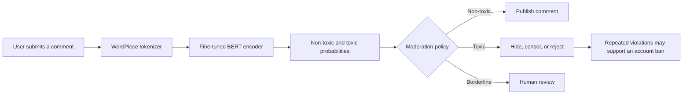

# Transformer Comment Classification

This project explores how a Transformer can support content moderation by
classifying English comments as **non-toxic** or **toxic**. It contains two
complete modeling approaches: an original Transformer encoder built with
PyTorch and a BERT encoder pretrained with Masked Language Modeling (MLM) and
Next Sentence Prediction (NSP), then fine-tuned for binary classification.

The fine-tuned BERT model is the final model used by the local desktop
application. Its trained weights and tokenizer are included in the repository,
so comments can be analyzed locally without downloading the dataset, contacting
an external API, or training the model again.

## The moderation problem

Imagine a social network where users publish thousands of comments every
minute. A team of human moderators cannot inspect every message before other
users see it. Toxic comments may therefore remain visible long enough to harm a
conversation, target another user, or encourage further abuse.

In this hypothetical scenario, the platform sends each new comment to the BERT
classifier. The model returns a probability for each class:

- **Non-toxic:** the comment can be published normally.
- **Toxic:** the platform can hide, censor, reject, or queue the comment for a
  moderator. Repeated toxic behavior could also contribute to an account-ban
  decision.
- **Uncertain:** a production system could send borderline predictions to a
  human moderator instead of making an automatic decision.

The model supplies the toxicity prediction; the social network defines the
policy that acts on it. The desktop application in this repository simulates
that moderation step by accepting a comment, displaying both class
probabilities, and recommending either **Ban Comment** or **Do not ban
comment**. It does not connect to a real social network or modify user accounts.



## How the project addresses it

The project covers the complete machine-learning path from raw moderation data
to a usable local prediction interface:

1. It prepares and cleans the Jigsaw toxic-comment dataset.
2. It converts the original six toxicity indicators into one binary target.
3. It trains tokenizers only on the training split to avoid data leakage.
4. It compares a custom PyTorch Transformer with a BERT-based approach.
5. It pretrains BERT with MLM and NSP so the encoder learns language patterns
   from the comment corpus before seeing the classification objective.
6. It fine-tunes the pretrained encoder to distinguish toxic from non-toxic
   comments.
7. It evaluates the models on a held-out test set.
8. It loads the saved BERT checkpoint in a native PySide6 desktop application
   for local moderation experiments.

## Features

- Binary classification: **non-toxic** or **toxic**
- Custom BPE tokenizer trained only on the training split
- Transformer encoder implemented with PyTorch
- BERT WordPiece, MLM, NSP, and toxic-classification training notebook
- Stratified 80/10/10 train, validation, and test split
- Class-weighted loss for the imbalanced dataset
- Automatic CUDA, Apple Silicon MPS, or CPU selection
- Local PySide6 desktop application backed by the fine-tuned BERT model
- Separate scripts for tokenizer and model training
- Tests for inference, serialization, training, and the desktop interface

## Dataset

The project uses the Jigsaw Toxic Comment Classification Challenge dataset from
Hugging Face:

```text
hf://datasets/thesofakillers/jigsaw-toxic-comment-classification-challenge/train.csv
```

The original toxicity columns are combined into one binary target. A comment is
labeled toxic when at least one of these columns is positive:

- `toxic`
- `severe_toxic`
- `insult`
- `identity_hate`
- `obscene`
- `threat`

Rows with missing, empty, or whitespace-only comments are removed. The resulting
data is split using seed `42` and stratification:

| Split | Percentage | Samples in the notebook run |
|---|---:|---:|
| Training | 80% | 127,656 |
| Validation | 10% | 15,957 |
| Test | 10% | 15,958 |

## Original Transformer architecture

The classifier uses token and learned positional embeddings followed by a
Transformer encoder. The first token, `[CLS]`, is used as the sequence
representation for the final classifier.

| Setting | Value |
|---|---:|
| Vocabulary size | 30,000 |
| Maximum sequence length | 128 |
| Embedding dimension | 256 |
| Attention heads | 8 |
| Transformer layers | 6 |
| Feed-forward dimension | 1,028 |
| Dropout | 0.1 |
| Output classes | 2 |
| Trainable parameters | 12,464,154 |

Training uses weighted cross-entropy, Adam with a learning rate of `0.001` and
weight decay of `0.01`, gradient clipping at `1.0`, batch size `32`, and `10`
epochs.

## Saved model results

The completed notebook run produced the following test results:

| Metric | Result |
|---|---:|
| Test loss | 0.4298 |
| Accuracy | 0.9219 |
| Non-toxic F1 | 0.9565 |
| Toxic F1 | 0.6227 |
| Macro F1 | 0.7896 |

The test confusion matrix was:

```text
[[13684   651]
 [  595  1028]]
```

## Fine-tuned BERT results

The BERT classifier saved in `model/bert_tuning/toxic_classifier/` uses a
30,000-token WordPiece vocabulary, 128-token sequences, hidden size `256`, six
encoder layers, eight attention heads, and a two-class classification head.

| Metric | Result |
|---|---:|
| Test loss | 0.2011 |
| Accuracy | 0.9561 |
| Non-toxic F1 | 0.9753 |
| Toxic F1 | 0.8059 |
| Macro F1 | 0.8906 |

The BERT test confusion matrix was:

```text
[[13805   530]
 [  170  1453]]
```

## Project structure

```text
Transformer_CommentClassification/
├── model/
│   ├── bert_tuning/
│   │   ├── pretrained/
│   │   └── toxic_classifier/
│   ├── toxicity_tokenizer.json
│   └── toxicity_transformer.pt
├── notebooks/
│   ├── bert_tuning.ipynb
│   ├── EDA_NLP.ipynb
│   └── Model_Training.ipynb
├── src/
│   ├── app.py
│   ├── bert_inference.py
│   ├── data.py
│   ├── model.py
│   ├── train_model.py
│   └── train_tokenizer.py
├── tests/
│   ├── test_desktop.py
│   └── test_pipeline.py
├── requirements.txt
└── README.md
```

## Environment setup

This workstation uses the following personal Python 3.14 environment:

```text
/Users/andreyvargassolis/vscode-python314/.venv
```

Activate it and install the project dependencies:

```bash
source /Users/andreyvargassolis/vscode-python314/.venv/bin/activate
cd /Users/andreyvargassolis/Desktop/Data_Science/Transformer_CommentClassification
python -m pip install -r requirements.txt
```

The project has been tested with Python `3.14.5`. VS Code is configured locally
to select this interpreter and activate it in new integrated terminals.

On another computer, activate any compatible Python environment before running
the installation command.

## Run the BERT pretraining and fine-tuning notebook

Open `notebooks/bert_tuning.ipynb` with the personal Python 3.14 kernel and run
the cells in order. The notebook provides a complete second training pipeline:

1. Creates the same stratified 80/10/10 data split used by the original model.
2. Trains a BERT WordPiece tokenizer on the training text only.
3. Creates balanced positive and negative NSP sentence pairs.
4. Applies dynamic 15% MLM masking with the standard 80/10/10 replacement rule.
5. Pretrains a compact BERT encoder jointly on MLM and NSP.
6. Transfers the complete pretrained encoder into a binary classifier.
7. Fine-tunes with weighted cross-entropy and selects the best validation macro-F1.
8. Evaluates the selected model once on the held-out test split.

The BERT artifacts are kept separate from the original Transformer:

```text
model/bert_tuning/pretrained/
model/bert_tuning/toxic_classifier/
```

The full pretraining run is computationally expensive. For a short pipeline
check, set `MAX_PRETRAIN_ANCHORS` in the notebook to a smaller integer before
starting MLM and NSP training.

## Run the desktop application

With the personal environment active, run:

```bash
python src/app.py
```

The application opens as a native desktop window. It does not start a web server
or require a browser. It loads `model/bert_tuning/toxic_classifier/` entirely
from local files. Enter an English comment and select **Check comment**. The
application displays one of these decisions:

- **Ban Comment** for class `1` (toxic)
- **Do not ban comment** for class `0` (non-toxic)

It also displays the probability assigned to each class. Inference runs in a
worker thread so the window remains responsive while the model is processing.

Optional arguments:

```bash
python src/app.py --device cpu
python src/app.py --model-dir model/bert_tuning/toxic_classifier
```

An alternative `--model-dir` must be a local Hugging Face sequence-classification
checkpoint with `NON_TOXIC` and `TOXIC` entries in `config.json`.

When `--device auto` is used, the application selects CUDA first, then MPS, and
finally CPU.

## Train a new tokenizer

The tokenizer must be trained before its corresponding model. Use a new output
directory to preserve the existing artifacts:

```bash
python src/train_tokenizer.py --output-dir model/new_training
```

The script trains a whitespace-pretokenized BPE vocabulary with a minimum token
frequency of `2`. It adds `[PAD]`, `[UNK]`, `[CLS]`, and `[SEP]`, then configures
fixed padding and truncation to 128 tokens.

To use a local copy of the Jigsaw CSV:

```bash
python src/train_tokenizer.py \
  --data-csv /path/to/train.csv \
  --output-dir model/new_training
```

The CSV must contain `id`, `comment_text`, and all six original label columns.

## Train a new model

Use the same data source and output directory used for the tokenizer:

```bash
python src/train_model.py --output-dir model/new_training
```

For a local CSV:

```bash
python src/train_model.py \
  --data-csv /path/to/train.csv \
  --output-dir model/new_training
```

Available training options include:

```bash
python src/train_model.py \
  --output-dir model/new_training \
  --epochs 10 \
  --batch-size 32 \
  --device auto
```

The training script saves:

- `toxicity_transformer.pt`: final model `state_dict`
- `training_history.json`: loss and accuracy by epoch
- `test_metrics.json`: test loss, accuracy, classification report, and confusion matrix

Existing model and tokenizer files are protected from accidental overwrites. A
newly trained model must always remain paired with the tokenizer from the same
output directory because token IDs can differ between tokenizer runs.

## Run the tests

Run the complete test suite with the personal environment active:

```bash
python -m unittest discover -s tests -v
```

The tests verify:

- compatibility with the saved notebook model
- model and tokenizer save/load behavior
- tokenizer padding, truncation, and unknown-token handling
- synthetic end-to-end training
- desktop classification and clearing behavior
- empty input and inference error handling
- safe application shutdown during an active prediction

Synthetic tests write only to temporary directories and do not modify the saved
model, tokenizer, or notebooks.

## Notes and limitations

- The training dataset is primarily English, and the saved model has not been
  evaluated for Spanish comments.
- Each comment is limited to 128 tokens, including special tokens.
- The decision uses the class with the highest softmax probability, matching the
  notebook implementation.
- The desktop app demonstrates a moderation decision. It does not connect to,
  publish to, or delete content from any external platform.
- The scripts train from scratch and do not resume optimizer state from a previous
  run.
